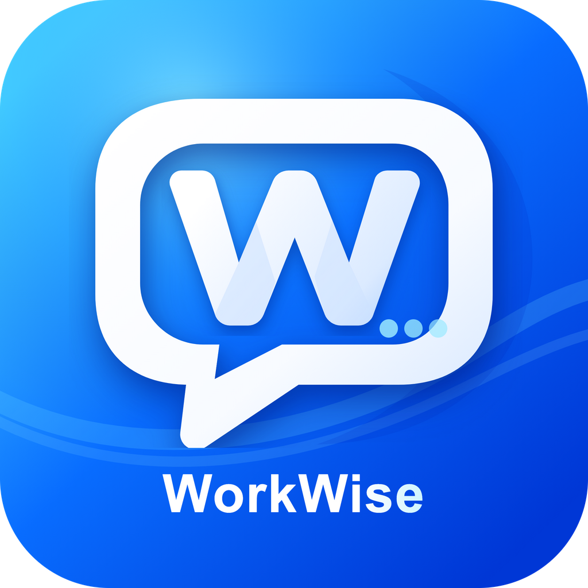

<p align="center">
  
</p>

# WorkWise

An AI workbench for engineering, infrastructure, and business operations.

[简体中文](./README.md) | English

[Project](https://github.com/wangjiawei508/WORKGPT) | [Downloads](https://github.com/wangjiawei508/WORKGPT/releases)

> Fork / attribution: this project is a renamed fork/import of `AdrianAndroid/DeepSeek-GUI`. See [FORK_NOTICE.md](./FORK_NOTICE.md).

WorkWise 0.2.0 is a product and positioning upgrade. It keeps the local desktop agent workflow, writing tools, built-in Skills, plugin marketplace, Markdown export, and GUI update flow, while repositioning the app for engineering, infrastructure, urban renewal, and operations workflows.

## Positioning

WorkWise is intended to grow into a practical AI workbench for engineering teams:

- Engineering and infrastructure: protection-area monitoring, operation-period monitoring, pits, tunnels, bridges, inspection, structural safety, and urban renewal.
- Documents and delivery: plans, daily/weekly/monthly reports, summaries, review responses, bids, and technical notes.
- Data and operations: monitoring analysis, business briefs, resource dispatch, weekly reports, delivery management, and enterprise knowledge bases.
- Agent ecosystem: bundled industry Skills plus GitHub-managed Skills that can be updated later.

## Capability Status

| Status | Scope |
| --- | --- |
| Ready now | Code workbench, Write workbench, model settings, workspace threads, bundled engineering Skills, Help center, download links, and GUI update checks |
| Preview | MCP marketplace, GitHub Skill sync, complex Markdown/DOCX export, phone connections, and scheduled automation |
| Roadmap | Infrastructure inspection, urban renewal, digital twins, operations analytics, bidding support, enterprise knowledge bases, and more industry agent packs |

## Key Features

- **Code workbench**: choose a workspace, start a thread, review reasoning, tool calls, todos, file changes, and command approvals.
- **Write mode**: manage Markdown/TXT files, use Live/Source/Split/Preview views, run writing actions, and use cross-document context.
- **Markdown export**: export HTML, PDF, DOC, and DOCX. PDF uses bundled Chromium; DOC uses Word-compatible HTML; DOCX prefers platform converters and falls back to the built-in WorkWise generator.
- **Engineering Skills**: protection-area monitoring, operation-period monitoring, engineering plans, report writing, data analysis, bidding knowledge, standards lookup, spreadsheets, and document generation.
- **Writing Skills**: humanization, style modeling, long-form writing, AI-trace review, and Chinese writing polish.
- **Marketplace details**: MCP and Skill items include detail pages, descriptions, source links, and install state.
- **Connect phone**: connect Feishu / Lark, WeChat, or local webhooks for IM agents and background scheduled tasks.
- **Online updates**: check GitHub Releases or a configured update feed from Settings.

## Downloads

Download from [GitHub Releases](https://github.com/wangjiawei508/WORKGPT/releases). Future public releases ship only three installers:

| Platform | File |
| --- | --- |
| macOS Apple Silicon | `WorkWise-version-mac-Apple-Silicon.dmg` |
| macOS Intel | `WorkWise-version-mac-Intel.dmg` |
| Windows x64 | `WorkWise-version-win-x64.exe` |

Linux clients are not published. On first launch, configure a DeepSeek API key or a compatible Base URL/model provider in Settings.

## Local Data

For upgrade compatibility, some internal paths still keep the old `workgpt` name:

| Data | Default path |
| --- | --- |
| Default workspace | `~/.workgpt/default_workspace` |
| Write workspace | `~/.workgpt/write_workspace` |
| Kun runtime and sessions | `~/.workgpt/kun` or the OS app-data directory |
| Settings | macOS: `~/Library/Application Support/WorkWise/workgpt-settings.json`; Windows: `%APPDATA%\WorkWise\workgpt-settings.json` |

WorkWise will try to read existing settings from old `WORKGPT` / `workgpt` app-data folders during upgrade.

## Development

```bash
git clone https://github.com/wangjiawei508/WORKGPT.git
cd WORKGPT
npm install
npm run dev
```

Useful checks:

```bash
npm run typecheck
npm run lint
npm run test
npm run build
npm run generate:icons
```

## Release Rules

- WorkWise starts at version `0.2.0`.
- Public GitHub Release assets are limited to macOS Apple Silicon DMG, macOS Intel DMG, and Windows x64 EXE.
- Linux clients, intermediate build files, blockmaps, and update metadata are not published as user-facing assets.

Maintainer: [wangjiawei508](https://github.com/wangjiawei508).
