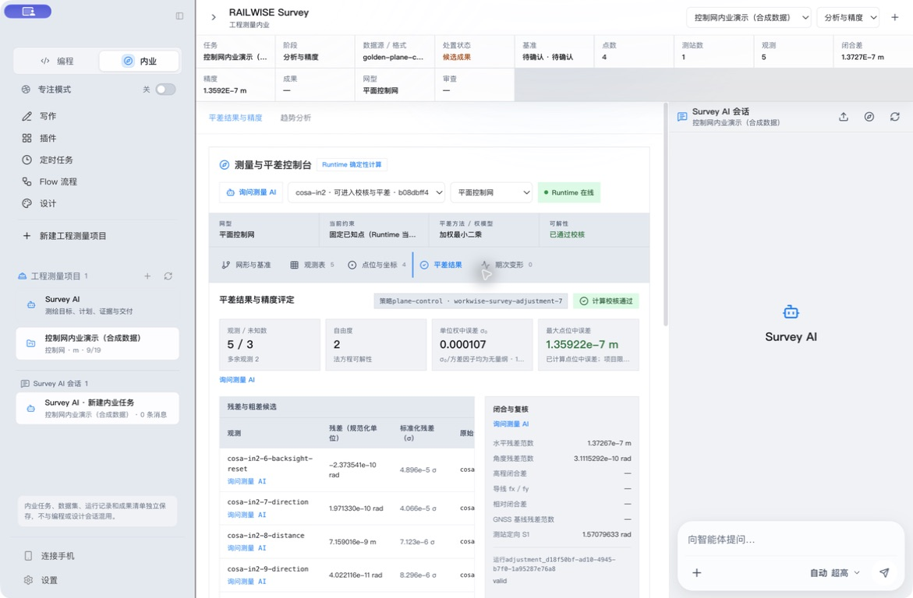
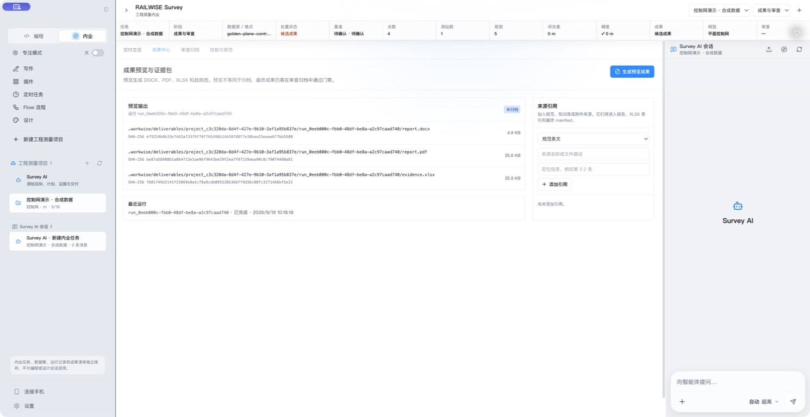

# RAILWISE AI

[简体中文](./README.md) | English

> Engineering survey processing and coding collaboration.

RAILWISE AI is a local-first desktop platform with Code and Survey as its primary workspaces. RAILWISE Survey connects original observations, deterministic adjustment, precision evidence and reviewable deliverables. Write, Design, Flow, plugins and schedules remain available as supporting tools. WorkWise package, storage and update identifiers are retained for compatibility.

The naming migration and four-stage Survey interface are undergoing isolated candidate acceptance. The public 0.5.0 installers are unchanged.

The latest source adds read-only externally studentized leveling residual diagnostics, original-record navigation and JSON export after strict source and calculation replay. It preserves historical adjustment results, leaves statistical assumptions unverified and makes no outlier or professional acceptance decision. These new controls still require exact signed-package UI acceptance.

- Product page: [www.railwise.cn/products/workwise](https://www.railwise.cn/products/workwise/)
- Direct mirror downloads: [Download and installation](https://www.railwise.cn/products/workwise/#download)
- Documentation: [kb.railwise.cn/products/workwise](https://kb.railwise.cn/products/workwise/)
- Public releases: [GitHub Releases](https://github.com/wangjiawei508/WorkWise/releases)

## Current release

The current stable release is **[v0.5.0](https://github.com/wangjiawei508/WorkWise/releases/tag/v0.5.0)**. It adds the engineering survey workbench, unified plugin market, verifiable installation, Codex plugin compatibility, cross-platform glass window chrome, and structured attachment vision handling. Installed 0.4.2 clients can update in the application. Public releases have three user-facing installers:

| Platform | Installer | Download |
| --- | --- | --- |
| macOS Apple Silicon | `WorkWise-<version>-mac-Apple-Silicon.dmg` | [Release assets](https://github.com/wangjiawei508/WorkWise/releases) |
| macOS Intel | `WorkWise-<version>-mac-Intel.dmg` | [Release assets](https://github.com/wangjiawei508/WorkWise/releases) |
| Windows x64 | `WorkWise-<version>-win-x64.exe` | [Release assets](https://github.com/wangjiawei508/WorkWise/releases) |

GitHub Releases remains the public release log and manual installer source. Signed updater metadata and platform update artifacts are published through the official `railwise.cn` Stable channel. There is currently no Linux client, portable edition, or activation-code flow.

## Engineering survey workbench

WorkWise 0.5.0 turns engineering survey work from a general chat entry point into a traceable specialist workspace:

- Import leveling, total station, GNSS, Leica GSI, RW5, RTKLIB, and common tabular data while preserving the original files, units, and source evidence.
- Identify formats by content and show preflight diagnostics. Required column mappings need explicit confirmation. Retain raw observations, unit conversions, closure checks, adjustment corrections, and derived results as separate reviewable records.
- Run deterministic leveling and control-network adjustment with source evidence and report/table exports. COSA IN1/IN2 are input paths; OU1/OU2 currently remain archive-review sources, not an accepted automatic comparison feature.
- Use the Compass entry to select files, inspect point summaries, run numeric checks, and generate deliverables. AI explains, diagnoses, and orchestrates; engineering calculations remain deterministic and require qualified human review.

The current source also adds a separate generalized-w / VCE / Huber / statistical-family model-trial workspace. Explicit model declarations and their basis are retained with immutable inputs and iteration history, and replayed before restoration or JSON export. Undetectable directions, nonpositive variance components and nonconvergence remain visible; trials do not remove observations or replace formal weights. Huber uses an explicitly declared fixed external scale; statistical families provide normal/t/chi-square tails and full-family Bonferroni correction, retaining missing members in the denominator. See the [input and record contract](./docs/qa/RAILWISE_SURVEY_ADVANCED_TRIALS_BACKEND.md). Acceptance of the new controls in the exact signed package is tracked separately.

Later source adds declared two-epoch reference comparison, static independent-observation append, and declared inspection scoring. Reference trials retain explicit GLS/equal choices and full covariance. Static append records each QR update and checks a separate full batch fit. Scoring retains exact fractions, missing items and vetoes under a bounded, source-checked subset of GB/T 24356-2023. These controls do not certify stable points, change formal weights or approve deliverables. See the [implementation and acceptance ledger](./docs/qa/RAILWISE_SURVEY_CONVERGENCE_STATUS.md).

Declared quality linkage assessment now connects a draft deliverable, retained materials, a complete first-round sample and explicit per-unit scoring records. Coverage, missing evidence and vetoes remain separate, and failed source revalidation clears the previous conclusion. The scope is at most eight complete sampled units; it does not authenticate materials, implement rectification/resampling, sign or approve deliverables. See the [integration and independent review](./docs/qa/evidence/railwise-quality-assessment/README.md). Packaged acceptance for this increment is tracked separately.

See the [engineering survey workbench overview](./docs/ENGINEERING_SURVEY_WORKBENCH_OVERVIEW.zh-CN.md) and [survey format acceptance matrix](./docs/qa/WORKWISE_0.5.0_SURVEY_FORMAT_ACCEPTANCE_MATRIX.md) for scope and evidence.

## Candidate UI preview

These Chinese light-theme screenshots show installed candidate `ba38649` with a synthetic three-point leveling network. Each image's commit and hash are in the [screenshot manifest](./website/products/screenshots/workwise/candidate-screenshots.json). They do not replace the released 0.5.0 installers. This package passed signing/notarization, a [real private updater round trip and installed quality-evidence workspace checks](./docs/qa/evidence/railwise-convergence-ba3864917e12/README.md), including individual checks, tamper rejection, valid-history recovery, the same record after restart, and a 960×640 window. Byte retention is not quality scoring, standards conformity or a human signature. Real-model acceptance, professional confirmation and remaining plan items are recorded in the ledger below.





See the [complete task/evidence ledger](./docs/qa/RAILWISE_SURVEY_CONVERGENCE_STATUS.md) for remaining work.

## Why WorkWise

AI should do more than answer a one-off prompt. Real work needs project material, files, sessions, methods, and delivery standards to persist together.

1. **Persistent context**: local workspaces, conversations, and documents stay organized around the same task.
2. **Writing through delivery**: Markdown writing, preview, rich-text copying, and Word / PDF delivery live in one workflow.
3. **Reusable experience**: repeatable methods, templates, and standards can become Skills instead of one-off prompts.
4. **Bounded extensibility**: MCP and plugins add tools and data sources only after their purpose and permissions are understood.

## Core capabilities

### Code workbench

Collaborate around local projects and source material: understand, modify, test, build, review, and deliver. Sessions, plans, todos, goals, and permission settings support longer task chains without replacing human judgment.

### Write workbench

Use a complete document workflow for Markdown and text work:

- Edit, preview, and organize Markdown and text content.
- Copy rich text and deliver through HTML, PDF, DOC, and DOCX paths.
- Use Skills such as AI Word, humanized writing, and PPT Master to improve structure, expression, and review.
- Keep a human review step for facts, images, tables, layout, and formal delivery.
- Attach PDF and Office tender sources directly in Write, then start the bundled Tender Master workflow without switching to Code.

Read more: [Write and document export](https://kb.railwise.cn/products/workwise/write-export/).

For the exact WorkWise adapter scope and data boundaries, see the [DeepSeek Harness integration note](./docs/DEEPSEEK_HARNESS.zh-CN.md) (Chinese).

### Document attachments and retrieval

Attach PDF, DOCX, XLSX, PPTX, TXT, Markdown, CSV, PNG, JPEG, or WebP files directly to a conversation. Files are streamed into application-managed storage, validated, parsed locally, split into indexed sections, and retrieved only when needed. Long documents are not inserted wholesale into the initial model context; retrieval results preserve page, worksheet, or slide provenance.

Document content is always treated as untrusted reference material. It cannot override system instructions or grant tool permission. Encrypted, damaged, disguised, or oversized files are rejected with an explicit reason. MarkItDown is bundled for local parsing, while MinerU remains an optional local high-accuracy component for difficult scanned PDFs.

The desktop and Runtime default to DeepSeek V4.1-Flash using `deepseek-flash`, while preserving saved explicit selections. The model catalog specifies 1M context and up to 384K output, with adapters for reasoning, tools, JSON, Responses API and structured image parts. Actual availability and limits depend on the provider and account; local protocol tests do not establish successful live-service acceptance. Text-only providers use the configured loopback visual-evidence analyzer and report failures explicitly.

### Design workbench

Create multi-page structured canvases with text, shapes, images, layers, groups, undo/redo,
document-scoped Agent conversations, visible selection targets, and revision-safe canvas commands.
PPTX import uses a readable-first full-slide reference that can be selected and annotated; source
text, charts, and animations are not misrepresented as individually editable objects. Export the
active design to PNG or SVG, insert it into Write, or deliver a validated PPTX through PPT Master.

### Flow Preview

Build executable workflows by connecting typed trigger, Agent, retrieval, tool, control, approval, and output nodes. The three-column workbench brings node configuration, mock and single-node tests, publish validation, run history, recovery, and approval resumption into one page. Published flows can be invoked by Agents, schedules, or signed webhooks.

Flow is visible by default and labeled Preview. Nodes that require an unconfigured model, external account, or companion CLI show the missing capability, and flows with unresolved dependencies cannot be published. Restricted code execution and webhook signing, replay protection, and rate limits keep execution within explicit boundaries.

### Skills and MCP

Skills are WorkWise reusable assets for high-frequency methods, writing rules, templates, and domain processes. The MCP and plugin market provides source, purpose, and installation-state context before additional tools are connected.

Read more: [Skills and templates](https://kb.railwise.cn/products/workwise/templates/).

### Local first

Workspaces, sessions, and settings are centered on the local machine. Model calls use API keys or compatible services that you are authorized to use. Handle sensitive material, access permissions, and local cleanup according to your organization’s rules.

Read more: [Local data and security](https://kb.railwise.cn/products/workwise/security-data/).

## Capability status

| Status | Scope |
| --- | --- |
| Available now | Code, Write, Design, DeepSeek Harness structured attachment handling, reliable task runs, Agents, MCP V2, general document attachments, indexed retrieval, validated document delivery, and in-app updates |
| Preview | Flow canvas, typed nodes, mock and single-node tests, publish validation, run history, approval, and failure recovery |
| Optional | Local MinerU parsing, online Skill updates, mobile connection, and companion command-line tools |
| Direction | More multimodal generation nodes, industry nodes, and enterprise integrations |

Preview and directional items are not described as stable released features.

## Quick start

1. Download the installer that matches your device and install it.
2. Configure DeepSeek, Agnes AI, or another OpenAI-compatible service in Settings.
3. Choose a local project or source-material directory as a workspace.
4. Work on project tasks in Code, start a document in Write, or attach business files to a conversation.
5. Open Flow Preview when automation is useful, then review content, images, tables, and layout before formal delivery.

- [Quick start](https://kb.railwise.cn/products/workwise/quickstart/)
- [Installation guide](https://kb.railwise.cn/products/workwise/install-guide/)
- [FAQ](https://kb.railwise.cn/products/workwise/faq/)

### Installation notes

- **macOS**: When macOS shows a first-open security prompt, verify the installer source first. You can allow the app in System Settings > Privacy & Security; the installation guide includes a fallback `xattr` path when needed.
- **Windows**: When Defender or SmartScreen appears, verify the source, file name, and version before continuing under your organization’s security policy.
- **Model services**: API-key availability, quotas, model access, and billing are controlled by the provider and your account.

### In-app updates

WorkWise 0.5.0 checks the official `railwise.cn` Stable channel at startup and every 24 hours. The blue update icon first downloads in the background; after completion it changes to **Restart and update**. Before restarting, WorkWise saves edits and reports active Agent, Flow, and scheduled runs. The platform updater then replaces and relaunches the application without opening a browser or requiring another drag-and-drop installation.

Version 0.3.2 and earlier did not include the trusted production update channel, so those users need one final manual installation of 0.3.3. Subsequent stable releases can update in the application.

## Development

```bash
git clone https://github.com/wangjiawei508/WorkWise.git
cd WorkWise
npm install
npm run dev
```

Common quality checks:

```bash
npm run openspec:validate
npm run verify:brand-boundary
npm run typecheck
npm run lint
npm run test
npm run build
```

The local agent is provided by WorkWise Agent Runtime through a stable HTTP/SSE boundary with the desktop application.

## Release policy

- Public GitHub Releases expose the macOS Apple Silicon DMG, macOS Intel DMG,
  and Windows x64 EXE. ZIP, blockmap, signed update metadata, and checksums are
  published through the official `railwise.cn` update channel.
- Intermediate build artifacts are not published, and unverified roadmap items are not presented as released capabilities.
- [GitHub Releases](https://github.com/wangjiawei508/WorkWise/releases) is the public release log; verified Stable pointers are promoted only after signing, notarization, hash, download, and manifest checks pass.
- The historical 0.2.5 public behavior baseline is tracked in the [public behavior gap table](docs/PUBLIC_BEHAVIOR_GAP_0.2.5.zh-CN.md).

## Feedback

Please report issues or ideas through [GitHub Issues](https://github.com/wangjiawei508/WorkWise/issues). Include where possible:

- WorkWise version, operating system, and chip architecture.
- Reproducible steps, screenshots, or error logs.
- A minimal Markdown example for document-export issues.
- The source, trigger, and error message for Skills or MCP issues.

## License

[MIT](./LICENSE)
