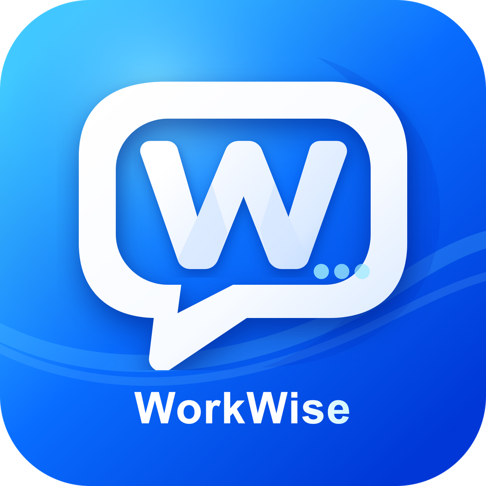
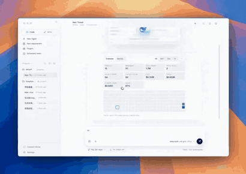
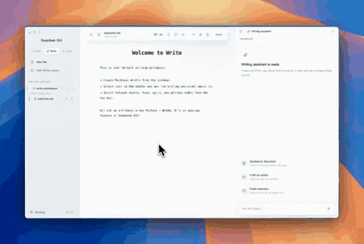

<div align="center">
  
  <h1>WorkWise</h1>
  <p><strong>让 AI 进入真实工作流。</strong></p>
  <p>本地优先的桌面 AI 工作台，把代码、写作、设计、技能与交付放在一个应用里。</p>
  <p>
    简体中文 · <a href="./README.en.md">English</a>
  </p>
  <p>
    <a href="https://www.railwise.cn/products/workwise/">产品主页</a> ·
    <a href="./docs/product-introduction.zh-CN.md">软件介绍</a> ·
    <a href="./docs/USER_GUIDE.zh-CN.md">使用指南</a> ·
    <a href="https://github.com/wangjiawei508/WorkWise/releases">版本与下载</a> ·
    <a href="https://github.com/wangjiawei508/WorkWise/issues">问题反馈</a>
  </p>
</div>

---

WorkWise 面向需要长期上下文、反复修改和正式交付的工作。它不只是一个聊天窗口：项目文件、会话、文档、方法和扩展能力围绕同一个本地工作区组织，让 AI 真正参与从理解任务到交付成果的完整过程。

**0.3.0 Agent 工作台**把“任务”提升为可恢复、可验证的持久化执行单元：模型的一次回复不再等同于任务完成；只有最终回复、必需节点和真实成果全部通过验收后，任务才会结束。默认简洁模式只展示对话、短进度、审批、错误和成果，技术过程可在“工作详情”中按需查看。

## 一眼看懂

| Code 工作台 | Write 写作工作台 |
| --- | --- |
| 理解项目、修改文件、运行工具、审查变更 | 编写 Markdown、调用写作助手、预览并导出文档 |
|  |  |

Design 设计工作台在 0.3.1 候选分支中提供可编辑多页画板、图片与组合、Agent 画板命令，以及 PNG、SVG、PPTX 和 Write 报告联动；正式安装包发布前仍需通过真实应用验收。

## 你可以用它做什么

- **处理本地项目**：围绕真实目录理解文件、规划任务、执行修改、运行测试并审查结果。
- **完成正式文档**：在 Write 中编辑和预览 Markdown，并通过 HTML、PDF、DOC、DOCX 等路径交付。
- **制作可编辑设计**：在 Design 中创建多页画板、导入图片或 PPTX，组合元素，并导出 PNG、SVG、PPTX 或嵌入 Write 报告。
- **复用自己的方法**：把模板、规范和高频流程沉淀为 Skills，减少重复说明。
- **扩展外部能力**：通过 MCP、命令行工具和插件市场连接经过确认的工具与数据源。
- **连接行业知识**：写作可结合本地资料与 RailWise 官方知识库，结果保留来源链接供复核。
- **保持数据边界**：工作区、会话和设置以本机为中心；敏感资料是否发送给模型由用户配置和权限决定。
- **持续完成长任务**：步骤或模型尝试触顶时保存 checkpoint 并安全续跑；重启后恢复尚未完成的任务。
- **解析本地文档**：内置 MarkItDown 处理 PDF/Office；复杂扫描件可按需安装本地 MinerU，不会自动上传公共云端。

## 核心体验

### Code：从任务到可审查的修改

Code 工作台适合开发、资料整理、自动化和长链路任务。任务引擎持续执行 `plan → execute → verify → deliver` 节点；步骤上限、临时网络异常或单次模型停止不会被误报为成功。涉及审批、必要输入、安全阻断或不可恢复错误时会明确说明原因。

对话默认采用简洁模式，不铺开脚本、工具参数和 stdout；标准模式显示语义操作，开发者模式显示脱敏后的命令摘要、Diff 和指标。任何模式都不展示模型私有思维链，也不会隐藏审批、安全警告、失败节点和成果。

### Write：从草稿到可交付文档

Write 提供 Markdown 编辑、实时预览、选区助手、知识检索和多种文档导出。PPT Master、写作优化、行业报告等 Skills 可补充方法与模板，但事实、图片、表格和正式版式仍需人工复核。

导出 Word（DOCX）支持模板选择：内置学术论文、行政公文、商务报告、技术文档四个模板，可分别设置标题、正文、表格、代码块的中西文字体、字号、颜色、行距、对齐和缩进（含首行缩进），也可把调整后的样式另存为用户自定义模板。公文模板符合 GB/T 9704 常见排版（方正小标宋二号标题、仿宋_GB2312 三号正文、首行缩进 2 字符）。

### Design：从画板到文档和演示文稿

Design 以工作区内 `.workwise/design` 为持久化边界，支持多页画板、图片资源、预设形状、结构化组合、撤销/重做和冲突保护。Agent 通过带 revision 和幂等键的画板命令修改当前文档，不会绕过 WorkWise Agent Runtime 另建一套模型通道。

导出前会先保存当前画板。PNG、SVG 可直接下载，PPTX 会验证真实 OOXML 结构，Write 联动会生成带来源信息的报告成果。导入 PPTX 时保留可安全转换的文字、图形、图片、旋转和组合关系；无法等价还原的效果会明确给出警告。

### Skills、MCP 与命令行工具

插件市场把能力分为三类，界面保持简单：

1. **Skills**：可复用的工作方法和专业流程。
2. **MCP**：连接外部工具与数据源的标准接口。
3. **命令行工具**：由 WorkWise 隔离管理，或引导安装配套应用。

内置项目会显示来源、安装方式和安全状态；未通过路径、体积或包结构检查的 Skill 不会被安装。

内置 PPT Master 使用经审计的 4.0.0 固定提交快照，保留核心脚本、参考资料、工作流和轻量模板；大体积图标库、AI 对比图片、用户项目、生成导出和备份不随客户端分发。

### Agent、权限与文档理解

- 内置 General、Explore、Review、Research 四个只读模板，可克隆为全局或工作区 Agent。
- 工作区权限分为只读、工作区写入、可信和完全访问；外部目录默认只读，提权必须确认。
- MCP V2 支持全局/工作区范围、工具授权、连接诊断和 OAuth PKCE，凭据只保存为安全引用。
- PDF.js 负责 PDF 阅读、缩放和搜索；MarkItDown 负责结构化文本。MinerU 是可选高精度组件，不进入三个客户端安装包。
- 请求 PPTX、DOCX、XLSX 或 PDF 时，成果必须通过格式验证；HTML 或改扩展名文本不能冒充正式成果。

## 三步开始

1. 从 [GitHub Releases](https://github.com/wangjiawei508/WorkWise/releases) 下载与你的电脑匹配的安装包。
2. 首次启动时选择语言，配置你有权使用的模型 API Key，并选择本地工作区。
3. 在 Code 中处理项目，或在 Write 中创建文档；需要时再添加 Skills、MCP 或命令行工具。

### 支持平台

| 平台 | 架构 | 安装包 |
| --- | --- | --- |
| macOS | Apple Silicon | `WorkWise-*-mac-Apple-Silicon.dmg` |
| macOS | Intel | `WorkWise-*-mac-Intel.dmg` |
| Windows | x64 | `WorkWise-*-win-x64.exe` |

当前不提供 Linux 桌面客户端和便携版。请始终从 [GitHub Releases](https://github.com/wangjiawei508/WorkWise/releases) 或 [WorkWise 产品主页](https://www.railwise.cn/products/workwise/)进入下载。

## 更新与帮助

WorkWise 默认从官方 GitHub Releases 检查新版本：

- 启动后在后台检查，发现新版本时显示提醒。
- 可从“帮助 → 检查更新”或“设置 → 通用 → 软件更新”手动检查。
- 支持自动安装的构建可在应用内完成更新；其他情况会打开版本下载页。
- 帮助菜单同时提供产品主页、个人主页、软件介绍、GitHub 项目和日志目录。

## 能力状态

| 状态 | 说明 |
| --- | --- |
| 稳定能力 | Code、Write、持久化任务、简洁对话、Agent、四级权限、MCP V2、Git checkpoint、PDF/Office 解析与成果验证 |
| 候选版验收中 | Design 多页画板、图片与组合、Agent 画板命令、PNG/SVG/PPTX 导出和 Write 联动 |
| 可选能力 | MinerU 高精度解析、在线 Skill 更新、连接手机、定时任务和外部命令行工具 |
| 后续方向 | Flow、MiMo、MiniMax 多模态和更多行业智能体 |

预览能力和后续方向不会被描述为已经稳定交付的功能。详细边界见[软件介绍](./docs/product-introduction.zh-CN.md)。

## 本地数据与安全

- 新版数据默认存放在 `~/.workwise`，项目计划和规范存放在工作区内的 `.workwise`。
- WorkWise 不要求激活码；模型调用的账号、额度和计费由相应服务商管理。
- 使用客户资料、商业文件或内部知识前，请遵循组织的数据分级和授权要求。
- 安装第三方 Skill、MCP 或命令行工具前，请核对来源、许可证和所需权限。

更多说明：[本地数据与安全](https://kb.railwise.cn/products/workwise/security-data/)。

## 开发与贡献

```bash
git clone https://github.com/wangjiawei508/WorkWise.git
cd WorkWise
npm install
npm run dev
```

提交前建议运行：

```bash
npm run openspec:validate
npm run verify:brand-boundary
npm run verify:document-licenses
npm run typecheck
npm run lint
npm run test
npm run build
```

- [开发说明](./docs/DEVELOPMENT.zh-CN.md)
- [贡献指南](./docs/CONTRIBUTING.zh-CN.md)
- [0.2.5 公开行为差距表](./docs/PUBLIC_BEHAVIOR_GAP_0.2.5.zh-CN.md)

## 反馈

欢迎在 [GitHub Issues](https://github.com/wangjiawei508/WorkWise/issues) 提交问题和建议。为了更快定位，请附上 WorkWise 版本、操作系统与架构、复现步骤、截图或必要日志；不要公开 API Key、客户资料或其他敏感信息。

## 许可证与来源

WorkWise 以 [MIT License](./LICENSE) 发布。历史来源与第三方声明见仓库内许可证及来源说明文件。
