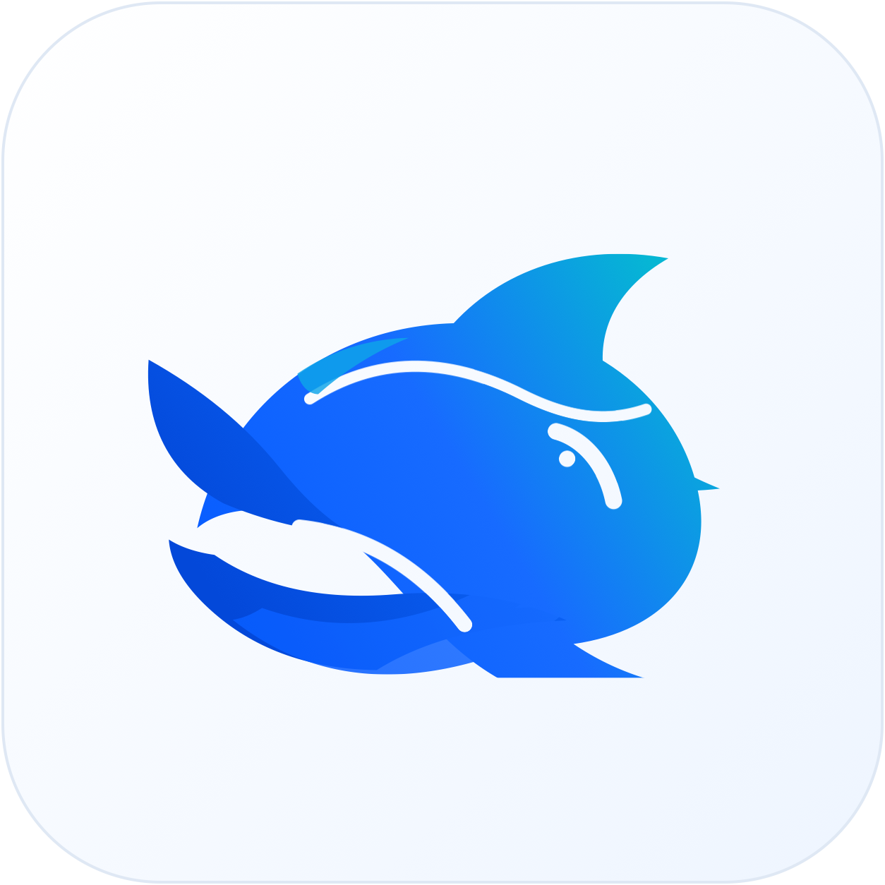

<p align="center">
  
</p>

# Kun

简体中文 | [English](./README.en.md)

> 把 Kun 的高 Token ROI 本地智能体能力带进桌面窗口：**Code** 处理项目、**写作**打磨文档、**连接手机**接入 IM 与定时任务——让每一个 token 尽量花在需求、代码、决策和结果上。

[官网](https://deepseek-gui.com) | [下载](https://deepseek-gui.com)

[](https://github.com/KunAgent/Kun/releases)
[](./LICENSE)

Kun（原 DeepSeek GUI）是一个面向开发者和高频 AI 工作者的本地桌面工作台。它以同名的本地运行时（位于 `kun/` 目录）为唯一 Agent 运行时，把终端里的智能体体验整理成更容易上手、更适合长期使用的应用：选择工作目录，发起任务，实时查看推理、工具调用和文件改动，并在需要时审批或回退。

传统监测和工程服务正在从单一交付走向综合化、数字化和运营化。团队面对的不再只是“写一份方案”或“导出一份报告”，而是更连续的工作链条：

- 项目前期要理解规范、招标文件、风险点和实施条件。
- 项目执行中要处理日报、周报、月报、监测数据、预警、消警和评审回复。
- 项目后期要形成总结、知识库、复盘材料和经营分析。
- 企业层面还需要沉淀方法论、统一交付标准、复用优秀模板，并把经验转化为可持续更新的智能体能力。

<p align="center">
  <a href="src/asset/img/code.mp4">
    
  </a>
  <a href="src/asset/img/write.mp4">
    
  </a>
</p>

## 设计思路

### 1. 本地优先，工作连续

WorkWise 是桌面应用，默认围绕本机工作区、文件、会话和设置运行。项目目录、写作空间、会话上下文、插件配置和 Skills 都可以在本地持续保留，适合长期项目和反复交付的工作。

### 2. 能力分层，避免“什么都说会”

应用内把能力分成正式可用、预览能力和路线图。已经能稳定交付的能力优先打磨体验；需要更多真实场景验证的能力放在预览区；更大的行业方向进入路线图持续演进。

### 3. Skills 是核心资产

WorkWise 鼓励把行业经验写成 Skills。地保监测、运营期监测、工程报告、投标知识、标准条文、经营分析、写作润色等能力都可以作为可安装、可更新、可复用的 Skill 存在，而不是散落在一次性 Prompt 里。

### 4. 写作和交付不是附属功能

很多工程和企业工作最终都落到文档交付。WorkWise 内置 Write 写作工作台，支持 Markdown 编辑、预览、上下文补全、文本处理、PDF/DOC/DOCX 导出和写作增强 Skills，目标是直接服务方案、报告、标书、汇报和知识库文档。

### 5. 插件市场要能看懂、能选择

插件市场不只展示一个名字。WorkWise 为 MCP 和 Skills 提供详情页，展示用途、说明、来源链接、安装状态和适用场景，减少“看不清是什么就不敢装”的问题。

## 当前能力状态

| 状态 | 能力 |
| --- | --- |
| 正式可用 | Code 工作台、Write 写作工作台、模型配置、工作区会话、内置工程 Skills、帮助中心、下载入口、GUI 更新检查 |
| 预览能力 | MCP 插件市场、GitHub Skill 同步、复杂 Markdown/DOCX 导出、连接手机、定时任务自动化 |
| 路线图 | 基础设施巡检、城市更新、数字孪生、经营分析、投标辅助、企业知识库、更多行业智能体套件 |

## 核心功能

### Code 工作台

适合项目开发、代码审查、需求拆解、脚本执行和自动化协作。

- **桌面聊天工作台**：多会话、流式回复、推理过程、工具调用、审批请求和文件改动都在同一个界面中展示。
- **项目级工作区**：为每个任务选择本地目录，按工作区管理会话，并支持文件预览、编辑器打开和 Git 分支选择。
- **新建需求**：先写需求草稿（背景、目标、验收标准），让需求 AI 帮忙澄清问题和补齐调研，再一键生成实施计划。
- **计划与 Todo**：`/plan` 或新建需求都会生成可编辑的计划文件，右侧计划面板会同步线程 Todo，方便把长任务拆成可跟踪步骤。
- **目标模式**：`/goal` 可以给当前会话设置长期目标，支持暂停、继续、清除和完成状态，让 agent 持续围绕同一个结果推进。
- **代码审查**：`/review` 可审查当前未提交改动，也可以指定 base branch、commit 或自定义审查范围，结果以 findings 卡片呈现。
- **旁支对话与会话管理**：`/btw` 可开启继承当前上下文的旁支对话；会话还支持压缩、分叉、归档和恢复。
- **变更审查**：内联 diff 和侧边审查面板会记录智能体产生的文件改动，便于在应用内完成 review。
- **权限可控**：支持只读、工作区可写、完全访问等模式，并可配置工具调用前是否需要审批。
- **运行时托管**：默认使用内置 Kun；也可以在设置中指定自己的 `kun` 可执行文件。
- **Skill 与 MCP**：在图形界面中创建 Skill、保存 MCP 配置、添加常用工具，并打开对应目录继续管理。
- **可开关的 agent 扩展能力**：Kun 通过配置开关逐步启用 MCP、Web fetch/search、Skills、独立 CLI、图片附件、跨会话 Memory 和子 agent 委派；设置页会显示运行时实际上报的能力与诊断状态。
- **连接手机**：可开启独立于普通聊天的后台 Agent，当前支持飞书 / Lark / 微信接入、IM webhook / relay，以及按计划自动执行任务。
- **定时任务**：创建一次性、每日、间隔或手动任务，指定工作区、模型和推理强度，让 Kun 在电脑唤醒时自动执行。
- **Write 写作模式**：独立管理 `~/.kun/write_workspace` 和自定义写作空间，读取 Markdown 文件树，支持 live Markdown 编辑、相对图片预览、DeepSeek FIM 短补全 / 灵感长补全（可用跨文本 BM25 + 关键词检索增强）、当前文档导出为 `HTML / PDF / DOC / DOCX`，以及选中文本后直接唤起 inline 写作助手。
- **高 Token ROI**：Kun 会稳定 prompt 前缀、跟踪 DeepSeek 原生缓存命中、按需压缩上下文和工具输出，并用 MCP search 渐进发现工具，把 token 留给需求、代码、决策和结果。
- **首次配置友好**：首次启动会引导你选择语言、填写 DeepSeek API Key，并按需配置兼容服务地址。
- **本地优先**：设置、会话状态、日志和运行时配置保存在本机；模型调用使用你自己的 DeepSeek API Key。
- **中英文界面**：应用和 README 均提供中文、英文版本，界面语言可随时切换。
- **跨平台使用**：提供 macOS `.dmg`（Apple Silicon 与 Intel）和 Windows x64 `.exe`；也可以从源码构建。

## 运行时：Kun

Kun 桌面应用当前唯一活跃的本地 Agent 运行时是仓库自带的同名运行时
**Kun**（位于 `kun/` 目录），整个项目也由此得名。Kun 取意于《庄子·逍遥游》中的
“北冥有鱼，其名为鲲”：它不是一个临时聊天壳，而是希望把模型能力沉到
更深的本地运行时里，让它能承载更长的上下文、更复杂的工具调用和更持续的
项目协作。技术上，Kun 是一个独立的 TypeScript 包，启动本地 HTTP/SSE
服务作为 GUI 与 agent loop 之间的唯一边界。

Kun 的核心理念是提高每一个 token 的 ROI。对用户来说，同样的上下文预算
应该尽量花在需求、代码、决策和结果上，而不是重复的工具 schema、失控的
工具输出、无效历史或已经可以被缓存复用的前缀上。它适合的不是一次性问答，
而是反复读写项目、持续调用工具、需要长期上下文的真实工作流。

Kun 集成了已被验证的设计：

- **借鉴自 Reasonix 的 cache-first agent loop**：immutable prompt prefix（带 sha256 指纹）、append-only session log、bounded TTL/LRU cache、inflight tracking with guaranteed cleanup、mid-turn steering queue、context compaction（保留 pinned constraints）、cache / usage telemetry。
- **Token economy 与工具上下文优化**：稳定系统前缀与工具 schema，按 DeepSeek 原生字段统计 cache hit/miss；对超长工具结果、长参数、base64 payload 和重复工具循环做边界压缩或抑制；当 MCP 工具很多时，可用 `mcp_search` / `mcp_describe` / `mcp_call` 渐进发现和调用工具，避免一次性把庞大的 MCP 工具目录全部塞进 prompt。

> 致谢：感谢 Reasonix 团队提供的可运行参考。Kun
> 的几乎全部性能特征——cache hit 率、token replay、断线重连、
> 审批中断——都可以追溯到该项目。具体设计取舍与借鉴映射
> 详见 [`docs/kun-architecture.md`](docs/kun-architecture.md)。

如果你想专门了解 Kun 如何做缓存优化，包括稳定前缀、工具 schema
规范化、DeepSeek 原生 hit/miss 统计、tool pair healing 和验证方法，
可以直接阅读
[`docs/kun-cache-optimization.md`](docs/kun-cache-optimization.md)。

Kun 的大块 agent 能力采用 feature flag 管理：`capabilities.mcp`
接入第三方 MCP server，`capabilities.web` 暴露 `web_fetch` /
`web_search`，`capabilities.skills` 发现 `skill.json` 与 legacy
`SKILL.md`，`capabilities.attachments` 支持图片附件和文本模型 fallback，`capabilities.memory`
启用跨会话记忆，`capabilities.subagents` 允许有预算上限的子 agent
委派。`kun run` / `kun chat` / `kun exec` 可脱离 GUI 运行；GUI 的设置页
会读取 `/v1/runtime/info` 与 `/v1/runtime/tools` 展示实际可用状态。
这些能力默认按配置关闭或受模型能力限制，完整配置示例和排障说明见
[`kun/README.md`](kun/README.md)。

技术架构（简化版）：

```text
Renderer (React)
  → KunRuntimeProvider
  → preload: kunGui.runtimeRequest / startSse
  → main: LocalHttpRuntimeAdapter
  → kun serve (HTTP + SSE)
  → cache-first AgentLoop
```

设置项在 **设置 → Agent 运行时** 里维护：binary path、port、
auto-start、API key、base URL、runtime token、data dir、model、
approval policy、sandbox mode、insecure 开关。如果之前保存过旧
provider，settings 会在读取时迁移到 `agents.kun`，再次保存后
只保留 Kun 配置。

完整的端点、CLI flag、环境变量、data dir 布局、SSE 事件 schema
见 [`kun/README.md`](kun/README.md)。

## 适合谁

- 想用 DeepSeek 处理真实代码库，但不想一直留在终端里的开发者。
- 希望清楚看到智能体做了什么、改了哪些文件、哪些操作需要批准的团队。
- 需要长期维护多个项目、多个会话，并希望把 Skill/MCP 配置沉淀下来的用户。
- 想用本地工作台连接 DeepSeek 官方 API 或 OpenAI 兼容服务的人。

---

## 工作台与入口

Kun 现在以 **Code** 和 **写作** 两个主工作台为核心，并提供
**连接手机**、**定时任务**、**插件 / Skill / MCP** 等入口。它们共享同一套
Kun 运行时与设置，但会话、工作区和界面布局彼此独立，可按任务随时切换。

### Code 模式

面向真实代码库的开发工作台：绑定本地项目目录，围绕仓库读写文件、执行命令、审查改动。

<p align="center">
  
</p>

- 按工作区管理多个 Agent 会话，实时查看推理、工具调用与文件变更。
- 支持内联 diff、变更审查面板，以及只读 / 工作区可写 / 完全访问等权限策略。
- 支持新建需求、`/plan` 计划、右侧计划面板、线程 Todo 和 `/goal` 长期目标，让复杂任务可以先澄清、再计划、再执行。
- 支持 `/review` 代码审查、`/btw` 旁支对话、会话压缩、会话分叉和归档恢复，适合长时间维护同一个项目上下文。
- 提供快捷任务卡片，可一键发起结构梳理、排错、实现方案或 UI 优化等对话。

### Write 模式

独立的 Markdown 写作工作台，把写作文件、保存状态与 AI 助手从 Code 会话里拆出来单独管理。

<p align="center">
  
</p>

- 管理 `~/.kun/write_workspace` 与多个自定义写作空间，左侧文件树支持新建、重命名与删除。
- 编辑器支持 **Live / Source / Split / Preview**，Live 模式在当前行保留 Markdown 源码，其余行实时渲染。
- 工具栏支持把当前 Markdown 文档导出为 `HTML / PDF / DOC / DOCX`，导出时会尽量保留标题、列表、任务清单、代码块、表格和本地图片。
- 内置 DeepSeek FIM 短补全与灵感长补全；选中文本可唤起 inline agent，右侧写作助手支持摘要、大纲与润色等快捷操作。

#### Markdown 渲染与导出

Write 模式的目标是让 Markdown 文档可以直接从写作、预览走到交付，而不需要额外打开一堆工具。

| 能力 | 说明 |
| --- | --- |
| Live 渲染 | 当前行保留 Markdown 源码，其他行实时渲染标题、列表、任务清单、图片、表格和分割线，适合边写边看版式。 |
| Split / Preview | Split 适合长文校对，Preview 适合最终检查；相对路径图片会按当前文档所在目录解析。 |
| 富文本复制 | 工具栏可把当前 Markdown 复制为富文本 HTML，方便粘贴到邮件、飞书、语雀、Word 等编辑器。 |
| 导出 HTML | 生成独立 HTML 文件，内置适合阅读和打印的样式，并尽量内联本地图片。 |
| 导出 PDF | 使用 Electron/Chromium 离屏窗口渲染 HTML，等待字体和图片加载完成后打印为 A4 PDF，适合合同、方案、周报、简历等固定版式交付。 |
| 导出 DOC | 生成 Word 兼容 HTML，扩展名为 `.doc`，适合快速给旧版 Word 或 WPS 打开编辑。 |
| 导出 DOCX | 优先使用随应用打包的平台转换器；转换器不可用时使用 WORKGPT 内置 DOCX 生成器，覆盖标题、段落、列表、引用、代码块、表格、链接和本地图片。 |

你提供的几类源码/工具包已经按用途拆开接入：

| 包 | 用途 | 集成状态 |
| --- | --- | --- |
| `Md2webV2.zip` | Web 版 Markdown 渲染与 DOCX 生成逻辑 | 已吸收其 `markdown-it` + `docx` + `highlight.js` 的思路，新增 WORKGPT 主进程内置 DOCX 生成器，避免只依赖 HTML→DOCX。 |
| `md2docx.zip` | Python 版 Markdown→DOCX 转换器源码 | 参考其“解析 Markdown → 写入 DOCX”的结构、中文排版和表格/图片处理能力；没有直接嵌入 Python 运行时。 |
| `md2docx_macos.zip` | macOS 平台转换器 | 可通过 `npm run prepare:converters` 提取到 `converters/darwin-arm64/`，打包 Apple Silicon 版本时随应用携带可发现的 Markdown 转 DOCX 工具。 |
| `md2docx_win.zip` / `md2docx_winV2.zip` | Windows x64 平台转换器 | 可通过 `npm run prepare:converters` 提取到 `converters/win32-x64/`，Windows x64 安装包会随应用携带可发现的 Markdown 转 DOCX 工具。 |
| `flux-markdown-master.zip` / `flux-markdown-1.34.445.zip` | macOS Swift Markdown 应用 | 因为原项目是 GPLv3 / commercial 双许可，没有直接复制代码；只参考其本地资源解析、预览/导出边界和测试覆盖方向。 |

平台转换器目录不会把 Linux 客户端带进发布包。`electron-builder` 只会收集：

```text
converters/darwin-arm64/
converters/darwin-x64/
converters/win32-x64/
```

执行下面的命令会从 `~/Downloads` 中的 `md2docx_macos.zip`、`md2docx_winV2.zip`（没有 V2 时使用 `md2docx_win.zip`）提取转换器：

```bash
npm run prepare:converters
```

目前你提供的 macOS 转换器包是 Apple Silicon 版本；Intel Mac 包仍会生成，也能使用 WORKGPT 内置 DOCX 生成器。如果后续提供 Intel 版转换器，放入 `converters/darwin-x64/` 后即可随 Intel 包一起发布。

### 连接手机

把 Kun 连接到手机和 IM 的后台自动化入口，让 Agent 在普通桌面聊天之外持续处理消息与定时任务。

<p align="center">
  
</p>

- 为飞书 / Lark / 微信等渠道配置独立 Agent，分别设定人设、默认模型与工作目录。
- 每个 IM Agent 拥有独立会话线程，可在 GUI 内直接调试回复与工具调用。
- 支持本地 webhook / relay，适合把 DeepSeek 接到团队协作或个人自动化流程中。
- 定时任务可设置一次性、每日、间隔或手动运行，任务会创建独立 Kun thread，并按配置发送 prompt。

---

### 写作增强 Skills

WorkWise 内置一组写作增强 Skills，用于提升 AI 写作结果的可读性、可信度和真实感：

前往 [GitHub Releases](https://github.com/KunAgent/Kun/releases) 下载最新版本：

| 平台 | 安装包 |
| --- | --- |
| macOS Apple 芯片 | `WorkWise-版本号-mac-Apple-Silicon.dmg` |
| macOS Intel 芯片 | `WorkWise-版本号-mac-Intel.dmg` |
| Windows 64 位 | `WorkWise-版本号-win-x64.exe` |

当前不发布 Linux 客户端，也不在 Release 页面展示中间构建文件。

### 2. 配置模型

首次启动后进入设置页：

- 填写 DeepSeek API Key，或配置兼容 OpenAI / DeepSeek 协议的模型服务。
- 设置 Base URL、默认模型和必要的代理环境。
- 检查 GUI 更新，确认是否为最新版本。

### 3. 使用 Code 工作台

1. 选择一个本地项目或资料目录作为工作区。
2. 输入任务，例如“检查这个项目的发布配置”或“帮我整理这批监测日报模板”。
3. 在时间线中查看 AI 的分析、命令、文件变更和待办事项。
4. 对高风险命令先确认，再让它继续执行。

### 4. 使用 Write 写作工作台

1. 新建或打开 Markdown / TXT 文件。
2. 在 `Live` 或 `Split` 模式下边写边预览。
3. 选中文本后让 WorkWise 改写、润色、扩写、压缩或统一风格。
4. 导出为 PDF、DOC、DOCX 或 HTML。
5. 对正式交付文件进行人工复核。

### 5. 使用 Skills 和插件

1. 打开设置中的 Skills 或插件市场。
2. 查看扩展详情，确认它适合你的任务。
3. 安装或启用对应 Skill / MCP。
4. 在 Code、Write、连接手机或定时任务中使用它。

## 推荐使用场景

- 编制地保监测、运营期监测、基坑监测、结构健康监测等工程方案。
- 生成日报、周报、月报、总结报告、评审回复和技术说明。
- 把项目资料整理成 Markdown 知识库，并导出为 Word / PDF。
- 进行投标文件结构梳理、评分点分析、技术响应和表达优化。
- 整理部门周报、项目经营简报、风险清单和管理层汇报材料。
- 为企业沉淀可复用的 Skills、模板、规范条文和交付方法。

## 本地数据与隐私

WorkWise 优先使用本地工作区和本地配置。为兼容历史版本，部分默认路径仍保留 `workgpt` 命名：

| 数据 | 默认位置 |
| --- | --- |
| 默认工作区 | `~/.workgpt/default_workspace` |
| 写作空间 | `~/.workgpt/write_workspace` |
| 运行时与会话数据 | `~/.workgpt/kun` 或系统应用数据目录 |
| 设置文件 | macOS: `~/Library/Application Support/WorkWise/workgpt-settings.json`；Windows: `%APPDATA%\WorkWise\workgpt-settings.json` |

卸载应用不会自动删除这些数据。彻底清理前，请确认不再需要历史会话、MCP 配置、Skills 和写作文件。

## 开发运行

```bash
git clone https://github.com/KunAgent/Kun.git
cd Kun
npm install
npm run dev
```

常用命令：

```bash
npm run typecheck
npm run lint
npm run test
npm run build
npm run generate:icons
```

打包命令：

```bash
npm run dist:mac
npm run dist:win
```

## 发布规则

- 公开 Release 只保留三个面向用户的安装包：macOS Apple Silicon、macOS Intel、Windows x64。
- 不发布 Linux 客户端。
- 不把 zip、blockmap、latest yml、中间构建文件作为公开下载资产。
- 安装包命名会明确标注 Apple Silicon、Intel 和 win-x64，方便用户选择。

1. 打开 Kun。
2. 在首次引导中选择界面语言。
3. 填入 DeepSeek API Key；如果需要，设置自定义 Base URL。
4. 选择默认工作目录，或使用应用自动创建的默认目录。
5. 新建会话，输入任务，让智能体开始工作。

WorkWise 会继续向三个方向演进：

- 行业智能体：从地铁监测扩展到基础设施巡检、城市更新、结构安全、投标辅助、项目经营和企业知识库。
- 文档交付：继续增强 Markdown 渲染、Word 导出、报告模板、图表生成和跨平台排版一致性。
- 插件生态：完善 MCP 市场、Skill 同步、企业内部 Skill 管理和更多第三方工具接入。

## 反馈

欢迎在 [Issues](https://github.com/wangjiawei508/WorkWise/issues) 反馈问题或建议。为了更快定位，请尽量附上：

- WorkWise 版本号。
- 操作系统和芯片架构。
- 问题截图、错误日志或复现步骤。
- 如果是导出问题，请附最小 Markdown 样例。
- 如果是 Skill / MCP 问题，请说明安装来源、触发方式和报错内容。

**连接手机** 与 **写作** 的详细说明见上文 [工作台与入口](#工作台与入口)。简要步骤：

- **连接手机**：在设置页启用后台自动化 → 添加飞书 / Lark / 微信连接 → 配置 Agent 人设、模型与工作目录 → 按需开启 webhook / relay 或定时任务。
- **Write**：切换到 Write 模式 → 使用默认写作空间或添加新空间 → 在 Live 编辑器中写作，配合补全、选区 inline agent 与右侧写作助手。

## 设置与使用

设置页集中管理这些内容：

- DeepSeek API Key、Base URL、运行时端口和运行时 Token。
- 是否自动启动本地运行时，以及是否使用自定义 `kun` 路径。
- 工具审批策略和文件系统权限范围。
- 默认工作目录、语言、主题、字体大小和完成通知。
- GUI 更新和本地错误日志。
- Skill 创建与目录管理、MCP 配置编辑。
- 连接手机后台自动化、飞书 / Lark / 微信连接、Webhook / Relay 和定时任务。

快捷键：

| 按键 | 功能 |
| --- | --- |
| `Enter` | 发送消息 |
| `Shift+Enter` | 在输入框中换行 |
| `Ctrl+Enter` | 发送消息 |
| `Esc` | 关闭面板或退出当前浮层 |

## Write 模式设计参考

Write 模式的目标是把 Kun 从“代码/聊天工作台”扩展成真正可长期写作的桌面工作区。实现时参考了本地 `openhanako` 项目中的几个方案：

- Markdown live 编辑：借鉴 openhanako 的 CodeMirror decorations 思路，当前行保留 Markdown 源码，非当前行用装饰层渲染标题、任务项、图片、分割线和表格。
- 选区 inline agent：借鉴 openhanako 的选区捕获与浮动输入框交互，用户选中文本后可以直接输入“润色/续写/分析”等指令，并把文件路径、行号和原文作为结构化引用交给写作助手。
- AI 会话隔离：Write 使用 Kun thread，但在 GUI 本地按写作空间维护 write thread registry，避免写作会话污染 Code / 连接手机侧栏。
- 文本补全：写作补全不走本地 Kun serve（**Kun** 是仓库自带的本地 HTTP/SSE Agent 运行时，唯一负责 GUI 与 agent loop 之间的通信，详见上一节「运行时：Kun」），而是直接调用 DeepSeek FIM Completion API，方便在纯写作场景里获得低延迟 ghost text。短补全使用较短 debounce、较小 token 预算和严格本地过滤；灵感长补全使用更长停顿触发、更大 token 预算，并只在行尾 / 段落边界工作。补全前会对写作空间内的 Markdown / 文本文件建立短 TTL 轻量索引，使用 BM25 + 关键词匹配召回跨文本片段，并以隐藏 Markdown comment 的形式注入 prompt，帮助模型保持术语、事实和风格连续性。

---

## 卸载

> 新版安装包应用名为 `Kun`；老版本 `DeepSeek GUI` 的数据会在首次启动时迁移并保留兼容链接。

### Windows

- 打开“设置 -> 应用 -> 已安装的应用”，找到 `Kun` 并卸载。
- 或在“控制面板 -> 程序和功能”中卸载。
- 也可以运行安装目录中的卸载程序。

Windows 安装器默认会创建开始菜单和桌面快捷方式。安装包不会强制固定到任务栏；如需固定，可在开始菜单中右键 `Kun` 并选择固定。

### macOS

- 将 `Kun.app` 从“应用程序”移到废纸篓。
- 如果首次打开被系统拦截，可在 Finder 中右键应用并选择“打开”。
- 本地未公证构建可先运行：

```bash
npm run mac:unquarantine -- '/Applications/Kun.app'
```

### 清理本地数据

默认卸载只移除应用文件，会保留本地设置、会话和运行时配置，便于后续重装恢复。若要彻底清理，可按需删除：

| 平台 | 应用数据位置 |
| --- | --- |
| macOS | `~/Library/Application Support/Kun` |
| Windows | `%APPDATA%\Kun` |
| Linux | `~/.config/Kun` |

Kun 数据默认位于 `~/.kun/data` 或应用数据目录下的 Kun data dir。删除前请确认其中没有你还需要的会话、MCP 或 Skill 配置。旧版 `~/.deepseekgui/kun` 会作为兼容链接保留一段时间，方便回滚。

---

## 更新

- 普通用户：可在设置页检查 GUI 更新，或前往 [GitHub Releases](https://github.com/KunAgent/Kun/releases) 下载最新安装包。

## 贡献指南

欢迎提交 bug 修复、UI/UX 优化、文档改进、本地化内容、构建发布流程和运行时集成相关改动。

协作约定：

- 日常协作与集成分支为 `develop`，稳定发布分支为 `master`。
- 新功能和修复建议从最新 `develop` 拉出短期功能分支开始。
- PR 默认提交到 `develop`，由维护者审核后再由维护者合入 `master` 发布。
- 对高风险改动请先沟通范围，再进入实现。
- 发起 PR 前运行 `npm run typecheck`、`npm run build`，以及 `npm run test`。
- 如果改动影响界面，请附上视频或 GIF。
- 如果改动影响项目逻辑，请附上对应单元测试。
- 如果改动影响使用方式，请同步更新 `README.md` 和 `README.en.md`。

详见 [CONTRIBUTING.zh-CN.md](./docs/CONTRIBUTING.zh-CN.md) 和 [DEVELOPMENT.zh-CN.md](./docs/DEVELOPMENT.zh-CN.md)。

## 本地构建

```bash
npm run build           # 生产构建
npm run dist:mac        # macOS 安装包（Apple Silicon + Intel）
npm run dist:win        # Windows 安装包（在 Windows 上运行）
npm run release:mac     # 手动兜底：构建并上传 macOS release 资源
npm run release:win     # 手动兜底：构建并上传 Windows release 资源
```

更多开发流程请看 [DEVELOPMENT.zh-CN.md](./docs/DEVELOPMENT.zh-CN.md)。

## 文档

| 文档 | 内容 |
| --- | --- |
| [docs/USER_GUIDE.zh-CN.md](docs/USER_GUIDE.zh-CN.md) | WORKGPT 桌面端操作文档：下载安装、首次配置、Code、Write、插件市场、连接手机、更新和本地数据 |
| [docs/kun-architecture.md](docs/kun-architecture.md) | Kun 单运行时方案、GUI 拆改范围、HTTP/SSE 合约、旧 agent 拆除说明 |
| [docs/kun-cache-optimization.md](docs/kun-cache-optimization.md) | Kun 缓存优化、token economy、MCP search、工具输出压缩与用量收益统计 |
| [docs/kun-contributing.md](docs/kun-contributing.md) | Kun 贡献指南：六边形架构、设计模式（Ports & Adapters / Functional Core Imperative Shell / 事件溯源 / 显式 DI / Composition Root）、4 个典型 PR 场景 |
| [kun/README.md](kun/README.md) | Kun 包：CLI、env、data dir、HTTP API |
| [CONTRIBUTING.zh-CN.md](docs/CONTRIBUTING.zh-CN.md) | 贡献说明 |
| [DEVELOPMENT.zh-CN.md](docs/DEVELOPMENT.zh-CN.md) | 本地开发与协作流程 |
| [CODE_OF_CONDUCT.md](CODE_OF_CONDUCT.md) | 社区行为准则 |
| [SECURITY.md](SECURITY.md) | 安全漏洞披露方式 |

---

## 致谢

Kun 的设计站在先行项目的肩膀上：

- **Reasonix** —— cache-first agent loop。`ImmutablePrefix`（带 sha256 指纹）+ 显式 mutation API、`AppendOnlySessionLog`（in-memory 窗口 + JSONL 磁盘重放）、`LruCache` / `TtlLruCache`、带 `finally` 清理的 `InflightTracker`、`SteeringQueue`（mid-turn 用户引导）、`ContextCompactor`（保留 pinned constraints）、`UsageCounter` + `CacheTelemetry` —— 这些都是 Reasonix 设计原型的 TypeScript 复刻与改进。Reasonix 的 reasoning events 拆分流、tool call / result 配对、usage replay 等设计也直接延续到 Kun 的事件合约。

也感谢以下项目和个人：

- **[LobsterAI](https://github.com/netease-youdao/LobsterAI)**：IM 管理、扫码绑定、Agent 绑定与自定义人设流程给了本项目连接手机能力很多启发。
- **OpenHanako**：Markdown live 编辑、写作空间、选中文本 inline agent 等 Write 模式交互和实现方案给了本项目重要参考。
- **[DeepSeek](https://github.com/deepseek-ai)**：提供模型与 API。
- 所有为 Kun 提交 issue、建议、代码和文档的贡献者。

<a href="https://github.com/KunAgent/Kun/graphs/contributors">
  
</a>

> [!NOTE]
> 本项目与 DeepSeek Inc. 无隶属关系。

## 许可证

[MIT](./LICENSE)

## Star 历史

[](https://www.star-history.com/?repos=KunAgent%2FKun&type=date&logscale=&legend=top-left)
