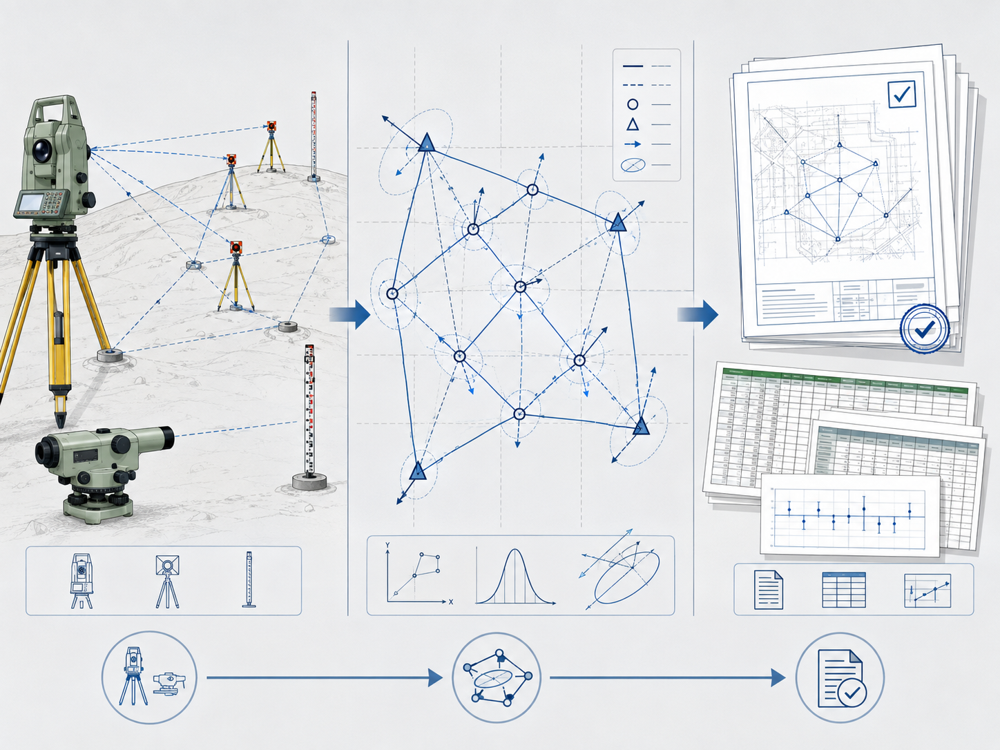

# WorkWise 0.5.0 文档配图真实场景验收

## 实际插入映射

此图映射到 `docs/plans/WORKWISE_0.5.0_FINAL_PLAN.md` 的“目标”章节，用来表达工程测量工作台的核心交付链路：外业观测资料进入同一本地运行时，由确定性数学内核完成控制网平差和精度评定，最后形成可审查报告与证据包。

图片只解释流程，不承载数值真值。报告中的坐标、高程、残差、协方差、阈值和成果哈希仍必须来自结构化 Runtime 输出。

## 验收结果

- 真实 PNG 文件存在且可以解码，尺寸为 `1448 × 1086`。
- 文件已从图片工具默认缓存复制到仓库工作区，没有把缓存路径冒充交付路径。
- 配图计划记录了稳定文件名、文档锚点、视觉目标、事实约束、比例、最终相对路径和 SHA-256。
- Markdown 已使用实际相对路径嵌入图片，构成可验证的插入映射。
- 未读取或写入第三方 API 密钥、`.env` 或旧 Claude/Gemini 凭据路径。
