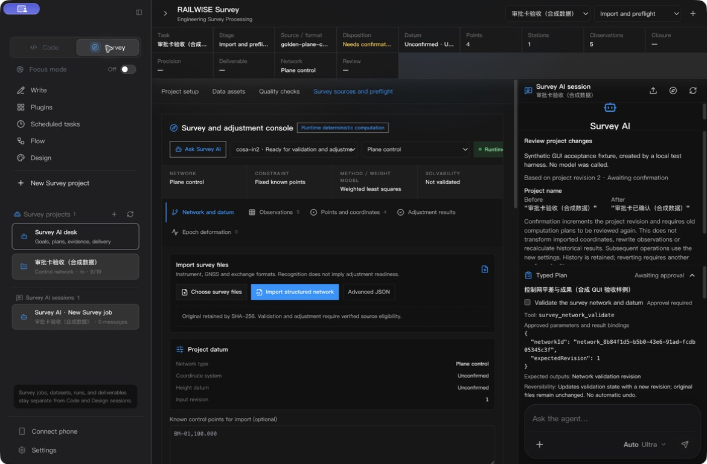
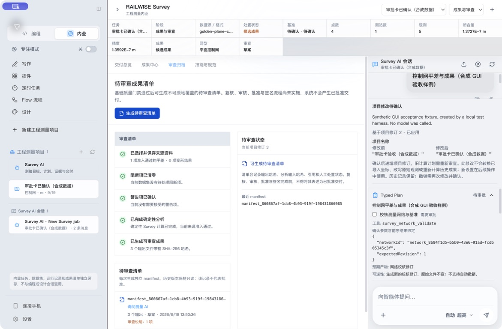

# df23e7d 精确安装包审批与成果验收

2026-09-19，源码 `df23e7d354c442f924ae3f2e984c314a5f65eca8`，隔离候选 0.5.0。签名、DMG 与 ASAR 哈希、GUI 后数据库状态及三份成果的磁盘哈希见 [acceptance.json](./acceptance.json)。

- Developer ID 深层严格签名和安装成功；真实 GSI/IN2 包内 Runtime 导入、校核、平差、成果及独立参考比较通过。stapler 65，无公证票据。Gatekeeper 的 security-disabled override 不能算公证通过。
- GUI 新建合成项目、改名、导入 `golden-plane-control-e2e.in2`；重启后修改建议卡正常读取，之前 d70d344 的 IPC 失败已消除。
- 修改建议和初始计划由明确标注的本地合成夹具经安装包服务生成，没有模型调用。界面确认改名后，项目 revision 从 2 到 3，建议变为 applied。Typed Plan 展示具体参数、前序绑定、预期产物及可逆性；三个写入/导出步骤必须分别选中才可启动。
- 项目已变更时启动原计划被拒绝，持久状态为 stale，没有产生 TaskRun。通过界面重建后保留原四个操作、网络选择和前序绑定，项目参数更新到 revision 3。
- 手动校核、平差、DOCX/PDF/XLSX 预览和草稿 manifest 成功；三份文件磁盘 SHA-256 与清单一致。草稿未显示为批准或归档。
- 英文深色、中文浅色常规和最大化窗口已目视检查；本次拖拽未实际缩窄，不计为窄窗口通过。合成验收内容不用于官网营销图。

实机发现并在后续源码修复：修改建议确认后侧栏/选择器名称未同步；重建计划的 Runtime 固定回执在英文界面仍显示中文；系统日期控件不跟随应用语言。后续包必须重新核验这些修正。

真实模型回合、精确包双真实格式 GUI 全链、全键盘、真实旧用户资料、公证、私有 HTTPS updater 往返与用户专业签认尚未完成。这份验收不能关闭整个总计划。

