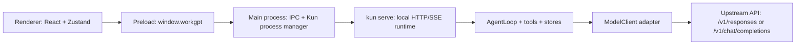

# Responses API 适配与架构学习笔记

这份文档给你一个从“能跑”到“看懂”的入口。你说的 `repose api` 我按
OpenAI **Responses API** 理解；如果你本来指的是别的协议，可以把这一份当成
OpenAI Responses API 适配路线的代码导览。

## 一句话总览

WORKGPT 不是在 Renderer 里直接调模型。它的主链路是：



Responses API 的适配点主要在 `kun/src/adapters/model/deepseek-compat-model-client.ts`。
GUI 侧只负责把用户操作变成 Kun HTTP 请求，再订阅 Kun 的 SSE 事件；真正的模型协议差异被封装在
`ModelClient` 适配器里。

## 这次为什么会出错

你截图里的报错核心是：

```text
model_not_found: No available channel for model deepseek-v4-pro
```

当时设置里“模型提供商”已经配置成了 `gpt-5.5`，但 `agents.kun.model` 还保留着
默认的 `deepseek-v4-pro`，并且 Kun 运行时 API 类型可能仍按旧的 Chat Completions 路径走。
所以请求被发到了一个不认识 `deepseek-v4-pro` 的上游通道。

我做的修复思路是让 Kun 运行时设置支持“继承 Provider”：

- Provider 配置保存 API key、base URL、API 类型、模型列表。
- Kun runtime 可以显式覆盖这些值，也可以继承。
- 如果 Kun runtime 仍是默认 `deepseek-v4-pro`，但当前 Provider 的模型列表里没有它，就自动使用 Provider 的第一个模型，例如 `gpt-5.5`。
- 当模型是从 Provider 继承来的，API 类型也跟随 Provider，比如 `responses`。
- 旧线程继续发消息时，也会带上解析后的模型，避免历史线程继续使用旧模型。

关键代码：

- `src/shared/app-settings-provider.ts`：`resolveKunRuntimeSettings()` 统一解析 Kun 的有效 API key、base URL、模型和 API 类型。
- `src/renderer/src/agent/kun-runtime.ts`：创建线程、发送消息、review 时使用解析后的运行时设置。
- `src/main/kun-process.ts`：启动 `kun serve` 时把解析后的 `--base-url`、`--api-type`、`--model` 传给 Kun。

## 官方 Responses API 和 Chat Completions 的差异

OpenAI 官方文档把 Responses API 描述为新的统一接口，适合状态、多模态、工具调用和 agent 工作流。
本项目当前没有使用 OpenAI 托管的会话状态，而是继续由 Kun 自己保存历史，然后每次把历史转换为
Responses API 的 `input` items 发出去。

参考：

- OpenAI 迁移指南：<https://developers.openai.com/api/docs/guides/migrate-to-responses>
- Create response API reference：<https://developers.openai.com/api/docs/api-reference/responses/create>

核心差异可以这样记：

| 关注点 | Chat Completions | Responses API | 本项目适配方式 |
| --- | --- | --- | --- |
| Endpoint | `/v1/chat/completions` | `/v1/responses` | 根据 `apiType` 选择路径 |
| 输入 | `messages` | `input` typed items | 把内部 `ChatMessage` 展平成 Responses items |
| 输出 | `choices[0].message` | `output[]` typed items | 把输出 items 映射成 Kun 的流式 chunk |
| 工具 schema | `{ type, function: { name, ... } }` | `{ type, name, description, parameters }` | 同一个 `ModelToolSpec` 映射两套形状 |
| 工具调用结果 | `role: "tool"` | `function_call_output` | 通过 `call_id` 对齐 |
| 最大输出 | `max_tokens` | `max_output_tokens` | 按 API 类型切换字段 |
| JSON 输出 | `response_format` | `text.format` | 按 API 类型切换字段 |
| 流式事件 | chat completion delta | `response.*` 事件 | 解析 `response.output_text.delta`、`response.function_call_arguments.delta` 等 |

## 内部端口：ModelClient

Kun 的 agent loop 不直接知道 OpenAI、DeepSeek 或别的供应商。它只认识一个端口：

```ts
export interface ModelClient {
  readonly provider: string
  readonly model: string
  stream(request: ModelRequest): AsyncIterable<ModelStreamChunk>
}
```

`ModelRequest` 是 Kun 自己的中间格式，包含：

- `systemPrompt`：稳定系统提示词，尽量保持字节稳定，方便缓存命中。
- `modeInstruction` / `contextInstructions`：动态指令，放在稳定前缀后面。
- `prefix` / `history`：Kun 自己维护的历史 item。
- `tools`：当前可用工具的规范化 schema。
- `attachments`：图片等附件。
- `stream`、`maxTokens`、`temperature`、`responseFormat`、`reasoningEffort` 等模型参数。

`DeepseekCompatModelClient` 的职责就是把这个中间格式翻译成具体 HTTP 请求，再把上游返回翻译回
`ModelStreamChunk`：

```text
ModelRequest
  -> Chat Completions body 或 Responses body
  -> fetch upstream
  -> parse JSON/SSE
  -> assistant_text_delta / assistant_reasoning_delta / tool_call_complete / usage / completed
```

这样做的好处是：AgentLoop、工具系统、存储、GUI 都不需要关心上游 API 的细节。

## 请求是怎样从 Kun 格式变成 Responses API 的

入口在 `DeepseekCompatModelClient.stream()`：

```ts
const useResponsesApi = this.config.apiType === 'responses'
const url = this.buildUrl(useResponsesApi ? '/v1/responses' : '/v1/chat/completions')
const body = this.buildRequestBody(request, stream)
```

当 `apiType === 'responses'` 时，`buildResponsesRequestBody()` 生成的主体大致是：

```ts
{
  model,
  stream,
  input: flattenResponsesInputItems(messages.map(messageToResponsesInputItem)),
  max_output_tokens,
  temperature,
  top_p,
  text: { format: { type: 'json_object' } },
  reasoning,
  tools: [
    {
      type: 'function',
      name,
      description,
      parameters
    }
  ]
}
```

这里有两个重要点。

第一，项目没有把 GUI 历史直接交给 OpenAI 托管状态，而是自己把历史重放成 `input`。所以你在代码里暂时看不到
`previous_response_id` 作为主路径。这样可以继续沿用 Kun 的 append-only log、fork、resume、cache
统计和本地会话存储。

第二，工具调用历史需要从 Chat 风格转换成 Responses 风格：

```ts
role: 'tool'
  -> { type: 'function_call_output', call_id, output }

assistant.tool_calls[]
  -> { type: 'function_call', call_id, name, arguments }
```

普通文本内容也要换成 typed content：

```text
user/system text      -> input_text
assistant text        -> output_text
image_url attachment  -> input_image
```

对应代码：

- `messageToResponsesInputItem()`
- `messageContentToResponsesContent()`
- `flattenResponsesInputItems()`

## 流式响应是怎样解析的

Responses API 的 SSE 不再是单纯的 `choices.delta`，而是很多 `response.*` 事件。本项目把它们统一翻译成
Kun 内部 chunk：

| Responses 事件 | Kun chunk |
| --- | --- |
| `response.output_text.delta` | `assistant_text_delta` |
| `response.reasoning_text.delta` | `assistant_reasoning_delta` |
| `response.reasoning_summary_text.delta` | `assistant_reasoning_delta` |
| `response.function_call_arguments.delta` | `tool_call_delta` |
| `response.function_call_arguments.done` | 补齐工具参数 |
| `item.type === "function_call"` 且 done | `tool_call_complete` |
| `response.completed` | `completed`，如果有工具调用则 stopReason 为 `tool_calls` |
| `response.failed` / `error` | `error` |

关键函数：

- `streamSse()`：读取 SSE 数据流。
- `consumeResponsesStreamPayload()`：解析单个 Responses 事件。
- `materializeResponsesNonStreaming()`：处理非流式 JSON 响应。
- `mapUsage()`：把 `input_tokens` / `output_tokens` 等字段映射成 Kun 的 usage。

注意：工具调用参数可能分多段流式返回，所以代码会维护一个 `pendingArguments` map，等参数完成或
`response.completed` 时再发出完整的 `tool_call_complete`。

## 整体架构分层

项目可以按五层读。

### 1. Renderer：产品界面

位置：`src/renderer/src`

职责：

- React UI、Zustand 状态、聊天时间线、设置页、写作工作区。
- 通过 `KunRuntimeProvider` 调用运行时。
- 映射 SSE 事件到 UI，而不是实现 agent 逻辑。

重点文件：

- `src/renderer/src/agent/kun-runtime.ts`
- `src/renderer/src/agent/kun-mapper.ts`
- `src/renderer/src/store/chat-store-runtime.ts`
- `src/renderer/src/components/settings-section-agents.tsx`

### 2. Preload：安全桥

位置：`src/preload/index.ts`

职责：

- 暴露 `window.workgpt.runtimeRequest()`。
- 暴露 `window.workgpt.startSse()` / `stopSse()`。
- 把 Renderer 的调用转成 Electron IPC。

### 3. Main process：桌面壳和 Kun 进程管理

位置：`src/main`

职责：

- 管理设置、日志、窗口、更新、IPC。
- 启动或复用 `kun serve`。
- 把 Renderer 的 `/v1/*` 请求代理到本地 Kun HTTP 服务。
- 把 Kun SSE 转发回 Renderer。

重点文件：

- `src/main/kun-process.ts`
- `src/main/resolve-kun-binary.ts`
- `src/main/runtime/kun-adapter.ts`
- `src/main/runtime-sse-ipc.ts`
- `src/main/ipc/register-app-ipc-handlers.ts`

启动 Kun 时，Main 会构造类似这样的参数：

```text
kun serve
  --host 127.0.0.1
  --port 8899
  --data-dir ~/.workgpt/kun
  --base-url ...
  --api-type responses
  --model gpt-5.5
  --approval-policy ...
  --sandbox-mode ...
```

### 4. Kun server：本地 HTTP/SSE 边界

位置：`kun/src/server`

职责：

- 提供 `/health`、`/v1/threads`、`/v1/threads/{id}/turns`、`/v1/threads/{id}/events` 等接口。
- 做 auth、routing、DTO 校验。
- 把 HTTP 请求交给 service 和 AgentLoop。

重点文件：

- `kun/src/server/runtime-factory.ts`
- `kun/src/server/routes/threads.ts`
- `kun/src/server/routes/turns.ts`
- `kun/src/server/routes/events.ts`

### 5. Kun core：AgentLoop、工具、存储、模型适配

位置：`kun/src`

职责：

- `loop/`：模型循环、上下文压缩、工具调用、steering、inflight 状态。
- `ports/`：抽象接口，比如 `ModelClient`、`ToolHost`、`ThreadStore`。
- `adapters/`：HTTP 模型客户端、文件存储、本地工具、MCP 工具。
- `services/`：thread/turn/review/usage 等业务服务。
- `contracts/`：HTTP DTO 和 zod schema。

最适合学习 Responses API 的路径是：

1. `kun/src/ports/model-client.ts`
2. `kun/src/adapters/model/deepseek-compat-model-client.ts`
3. `kun/tests/model-client.test.ts`
4. `kun/src/loop/agent-loop.ts`
5. `src/renderer/src/agent/kun-runtime.ts`

## 设置解析链路

设置相关代码分为“保存结构”和“运行时解析”。

保存结构在：

- `src/shared/app-settings-types.ts`
- `src/shared/app-settings-kun.ts`
- `src/shared/app-settings-provider.ts`

Provider 大致保存：

```ts
{
  id: 'openai',
  name: 'OpenAI',
  apiKey: '...',
  baseUrl: 'https://api.openai.com/v1',
  apiType: 'responses',
  models: ['gpt-5.5']
}
```

Kun runtime 大致保存：

```ts
{
  providerId: 'openai',
  apiType: 'inherit',
  model: ''
}
```

真正启动和发请求前，会调用：

```ts
resolveKunRuntimeSettings(settings)
```

它会得到最终值：

```ts
{
  apiKey: provider.apiKey,
  baseUrl: provider.baseUrl,
  apiType: 'responses',
  model: 'gpt-5.5'
}
```

这也是这次修复的核心：不要让 `agents.kun.model` 里的旧默认值偷偷覆盖 Provider 已经选好的模型。

## 如何配置 OpenAI Responses API

在 GUI 里建议这样配：

1. 打开 Settings。
2. 在模型 Provider / Agents 设置里添加或选择 OpenAI-compatible Provider。
3. API key 填 OpenAI key。
4. Base URL 填：

```text
https://api.openai.com/v1
```

5. API Type 选：

```text
responses
```

6. Models 里把 `gpt-5.5` 放到第一项，或者在 Kun runtime model 里显式填：

```text
gpt-5.5
```

7. Kun runtime 的 API Type 建议选 `inherit`，这样跟随 Provider。

如果你使用的是 New API、one-api、LiteLLM 或其他中转服务，必须确认它真的支持：

```text
POST /v1/responses
```

如果中转只支持 `/v1/chat/completions`，就应该把 API Type 改回 `chat_completions`，或者换支持
Responses API 的中转。

## 本地开发环境配置

### 前置要求

- Node.js 20+
- npm
- Git
- Windows 建议使用 PowerShell 或 Windows Terminal
- 一个可用的 API key

### 安装依赖

```bash
npm install
```

如果默认 registry 慢，可以用：

```bash
npm install --registry=https://registry.npmmirror.com
```

### 启动开发版

```bash
npm run dev
```

这个命令会先执行：

```bash
npm run build:kun
```

再启动：

```bash
electron-vite dev
```

所以修改 `kun/` 下的运行时代码后，重新跑 `npm run dev` 最稳。

### 常用校验命令

```bash
npm run typecheck
npm run build
npm test
```

只验证 Responses API / Kun 相关改动，可以先跑：

```bash
npx vitest run kun/tests/model-client.test.ts
npx vitest run src/shared/app-settings-provider.test.ts src/renderer/src/agent/kun-runtime.test.ts
```

我这次修复时重点跑过：

```bash
npx vitest run src/shared/app-settings-provider.test.ts src/shared/app-settings.test.ts src/renderer/src/agent/kun-runtime.test.ts
npx vitest run src/main/upstream-models.test.ts src/main/kun-process.test.ts src/main/runtime/kun-adapter.test.ts
npm run typecheck
npm run build
```

### 直接跑 Kun CLI

如果你想绕过 Electron，只看 Kun runtime，可以在构建后使用：

```bash
npm run build:kun
node kun/dist/cli/serve-entry.js serve --api-key YOUR_KEY --base-url https://api.openai.com/v1 --api-type responses --model gpt-5.5
```

也可以用环境变量：

```bash
set KUN_API_TYPE=responses
set KUN_MODEL=gpt-5.5
set KUN_BASE_URL=https://api.openai.com/v1
set OPENAI_API_KEY=YOUR_KEY
```

PowerShell 写法：

```powershell
$env:KUN_API_TYPE = 'responses'
$env:KUN_MODEL = 'gpt-5.5'
$env:KUN_BASE_URL = 'https://api.openai.com/v1'
$env:OPENAI_API_KEY = 'YOUR_KEY'
```

## 日志和排障

常见日志位置：

```text
%APPDATA%\WORKGPT\logs
%USERPROFILE%\.workgpt\kun
```

常见问题：

| 现象 | 可能原因 | 处理 |
| --- | --- | --- |
| `model_not_found deepseek-v4-pro` | Kun runtime 仍在用旧默认模型 | 确认 Provider 模型第一项是 `gpt-5.5`，Kun model 留空/继承或显式填 `gpt-5.5` |
| `404 /v1/responses` | 上游不支持 Responses API | 切回 `chat_completions` 或换支持 `/v1/responses` 的上游 |
| `401` / `403` | API key 错误或中转鉴权失败 | 检查 Provider API key、base URL、runtime token |
| 流式输出卡住 | SSE 中断、上游无数据、网络代理问题 | 看 Kun event log 和 GUI logs；必要时先用非流式测试 |
| `better-sqlite3.node` 版本警告 | 原生 SQLite 模块与 Electron Node ABI 不匹配 | 当前会回退 JSONL；不是模型请求失败的主因 |

调试时优先看两类信息：

1. GUI 日志：Kun 是否启动、端口、base URL、api type、model。
2. Kun thread events：真正的 turn error、HTTP status、上游错误体。

## 给学习者的阅读路线

建议按这个顺序读，不容易迷路：

1. `README.en.md` 的 Runtime: Kun 部分，先建立产品和架构感。
2. `docs/kun-architecture.en.md`，理解为什么 GUI 只保留单 Kun runtime。
3. `kun/src/ports/model-client.ts`，看 Kun 和模型之间的抽象边界。
4. `kun/src/adapters/model/deepseek-compat-model-client.ts`，看 Chat Completions / Responses API 的分叉。
5. `kun/tests/model-client.test.ts`，看请求体、流式事件、工具调用的预期行为。
6. `src/shared/app-settings-provider.ts`，看 Provider 与 Kun runtime 如何合并。
7. `src/main/kun-process.ts` 和 `src/main/resolve-kun-binary.ts`，看 Electron 如何启动 Kun。
8. `src/renderer/src/agent/kun-runtime.ts`，看 UI 如何创建线程、发送消息、订阅 SSE。

一个小练习：在 `kun/tests/model-client.test.ts` 里新增一个 Responses API 工具调用流式事件测试。
如果你能解释为什么 `response.function_call_arguments.delta` 需要先进入 `pendingArguments`，就基本理解这层适配了。
